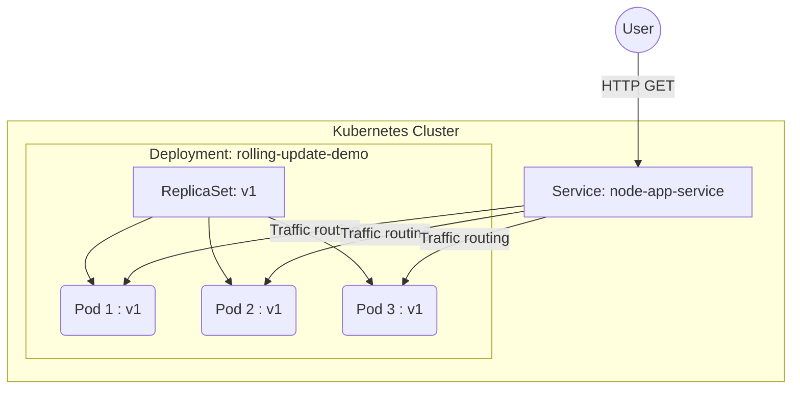
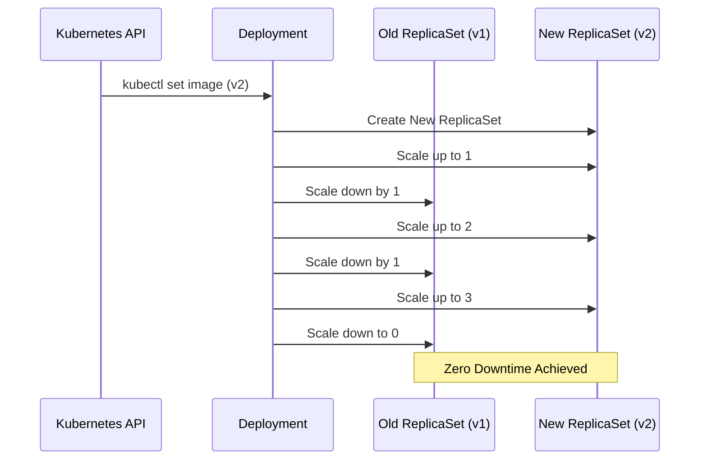

# Kubernetes Rolling Updates and Rollbacks Masterclass

A complete, production-ready guide to understanding and demonstrating Kubernetes Deployment strategies using Node.js, Docker, and Kubernetes.

## 📂 Project Structure

```text
.
├── app
│   ├── Dockerfile
│   ├── package.json
│   └── server.js
├── k8s
│   ├── deployment.yaml
│   └── service.yaml
└── README.md
```

## 🏗️ Architecture Diagrams

### Kubernetes Deployment Architecture



### Rolling Update Process



## 🧠 Core Concepts

### 1. Deployments
A **Deployment** provides declarative updates for Pods and ReplicaSets. You describe a desired state in a Deployment, and the Deployment Controller changes the actual state to the desired state at a controlled rate.

### 2. ReplicaSets
A **ReplicaSet's** purpose is to maintain a stable set of replica Pods running at any given time. As such, it is often used to guarantee the availability of a specified number of identical Pods. Deployments manage ReplicaSets automatically (you rarely interact with ReplicaSets directly).

### 3. Pods
A **Pod** is the smallest deployable unit of computing that you can create and manage in Kubernetes. A Pod contains one or more containers (e.g., Docker containers), with shared storage and network resources.

### 4. Rolling Updates
A **Rolling Update** is the default deployment strategy in Kubernetes. It updates Pods instance by instance, rather than bringing down all the old Pods at once. This ensures zero downtime. We control this using `maxUnavailable` and `maxSurge`.
- `maxUnavailable`: Maximum number of Pods that can be unavailable during the update.
- `maxSurge`: Maximum number of Pods that can be created over the desired number of Pods.

---

## 🚀 Step-by-Step Execution Guide

### Prerequisites
- Docker installed locally.
- A Kubernetes cluster (Minikube, Kind, or Docker Desktop Kubernetes).
- `kubectl` configured to interact with your cluster.
- A Docker Hub account.

*Note: Replace `<your-dockerhub-username>` with your actual Docker Hub username in the commands below.*

### Phase 1: Build and Push Docker Images

We will build three versions of our image:
- **v1**: The initial working version.
- **v2**: A successful update.
- **v3**: A simulated broken version to demonstrate rollbacks.

#### 1. Build Version 1
Command:
```bash
docker build -t <your-dockerhub-username>/node-app:v1 ./app
```
**Explanation:** `docker build` reads the `Dockerfile` and creates a container image. `-t` tags the image with your Docker Hub repository and version `v1`. The `./app` indicates the context directory containing the source code.

**Expected Output:**
```text
[+] Building 3.5s (14/14) FINISHED
 => [internal] load build definition from Dockerfile
 ...
 => => naming to docker.io/<your-dockerhub-username>/node-app:v1
```

#### 2. Push Version 1 to Docker Hub
Command:
```bash
docker push <your-dockerhub-username>/node-app:v1
```
**Explanation:** Uploads your local image to the Docker Hub registry so your Kubernetes cluster can pull it.

**Expected Output:**
```text
The push refers to repository [docker.io/<your-dockerhub-username>/node-app]
...
v1: digest: sha256:abc12345 size: 1374
```

#### 3. Build & Push Version 2 (The Update)
Command:
```bash
docker build -t <your-dockerhub-username>/node-app:v2 ./app
docker push <your-dockerhub-username>/node-app:v2
```

#### 4. Build & Push Version 3 (The Broken Version)
Command:
```bash
docker build -t <your-dockerhub-username>/node-app:v3 ./app
docker push <your-dockerhub-username>/node-app:v3
```

---

### Phase 2: Deploy Version 1 to Kubernetes

Before applying, ensure you have updated `k8s/deployment.yaml` with your Docker Hub username.

#### 1. Apply the Deployment and Service
Command:
```bash
kubectl apply -f ./k8s/deployment.yaml
kubectl apply -f ./k8s/service.yaml
```
**Explanation:** `kubectl apply` sends the YAML manifests to the Kubernetes API server, which creates the required resources (Deployment, ReplicaSet, Pods, and Service).

**Expected Output:**
```text
deployment.apps/rolling-update-demo created
service/node-app-service created
```

#### 2. Verify the Deployment
Command:
```bash
kubectl get pods
```
**Explanation:** Lists all pods to ensure they are up and running.
**Expected Output:**
```text
NAME                                   READY   STATUS    RESTARTS   AGE
rolling-update-demo-6b758b9cfb-8xg2k   1/1     Running   0          30s
rolling-update-demo-6b758b9cfb-cx4zt   1/1     Running   0          30s
rolling-update-demo-6b758b9cfb-tz789   1/1     Running   0          30s
```

Command:
```bash
kubectl get deployment
```
**Explanation:** Shows the status of the deployment, including desired and available replicas.
**Expected Output:**
```text
NAME                  READY   UP-TO-DATE   AVAILABLE   AGE
rolling-update-demo   3/3     3            3           1m
```

#### 3. Test the Application
Command (if using Minikube):
```bash
minikube service node-app-service
```
Or use port-forwarding:
```bash
kubectl port-forward svc/node-app-service 8080:80
```
Then visit `http://localhost:8080`.
**Expected Output on Browser:**
`Hello from Kubernetes! App Version: v1`

---

### Phase 3: Perform a Rolling Update (v1 -> v2)

#### 1. Trigger the Update
Command:
```bash
kubectl set image deployment/rolling-update-demo node-app-container=<your-dockerhub-username>/node-app:v2
# We will also update the ENV variable to simulate the v2 code change properly for this demo
kubectl set env deployment/rolling-update-demo APP_VERSION=v2
```
**Explanation:** `kubectl set image` updates the container image for the deployment. This triggers a new ReplicaSet to be created.

#### 2. Monitor the Rollout Status
Command:
```bash
kubectl rollout status deployment/rolling-update-demo
```
**Explanation:** Watches the rollout in real-time as old pods are terminated and new pods are created.

**Expected Output:**
```text
Waiting for deployment "rolling-update-demo" rollout to finish: 1 out of 3 new replicas have been updated...
Waiting for deployment "rolling-update-demo" rollout to finish: 1 old replicas are pending termination...
deployment "rolling-update-demo" successfully rolled out
```

#### 3. Verify ReplicaSets and History
Command:
```bash
kubectl get rs
```
**Explanation:** Lists the ReplicaSets. You will see an old one with 0 replicas and a new one with 3.
**Expected Output:**
```text
NAME                             DESIRED   CURRENT   READY   AGE
rolling-update-demo-6b758b9cfb   0         0         0       10m  (Old v1 ReplicaSet)
rolling-update-demo-8457c6699d   3         3         3       2m   (New v2 ReplicaSet)
```

Command:
```bash
kubectl rollout history deployment/rolling-update-demo
```
**Explanation:** Shows the revision history of the deployment.
**Expected Output:**
```text
deployment.apps/rolling-update-demo
REVISION  CHANGE-CAUSE
1         <none>
2         <none>
```

---

### Phase 4: Simulate a Failed Deployment & Rollback (v2 -> v3 -> v2)

Let's push a bad image (v3) that causes the health checks to fail.

#### 1. Deploy Broken Version (v3)
Command:
```bash
kubectl set image deployment/rolling-update-demo node-app-container=<your-dockerhub-username>/node-app:v3
kubectl set env deployment/rolling-update-demo APP_VERSION=v3
```

#### 2. Observe the Failure
Command:
```bash
kubectl get pods
```
**Explanation:** Because of our `readinessProbe` and `livenessProbe` in `deployment.yaml`, Kubernetes will detect that v3 is failing. The Rolling Update will *pause* to prevent bringing down the whole application.

**Expected Output:**
```text
NAME                                   READY   STATUS             RESTARTS   AGE
rolling-update-demo-8457c6699d-xxx     1/1     Running            0          15m  (v2 pod remaining)
rolling-update-demo-8457c6699d-yyy     1/1     Running            0          15m  (v2 pod remaining)
rolling-update-demo-999abc1234-zzz     0/1     CrashLoopBackOff   2          2m   (v3 pod failing)
```

#### 3. Analyze the Failure
Command:
```bash
kubectl describe deployment rolling-update-demo
```
**Explanation:** Provides detailed events and status of the deployment. You will see that the new ReplicaSet cannot scale up because the pods are failing their readiness probes. 
**Why Kubernetes restored the previous version?** It hasn't restored it automatically yet (unless using specific tools like Flagger), but it *prevented* the new bad version from taking over because the readiness probe failed. The old pods (v2) are still serving traffic.

#### 4. Execute Rollback
Command:
```bash
kubectl rollout undo deployment/rolling-update-demo
```
**Explanation:** Tells Kubernetes to revert to the previous revision (v2). Kubernetes scales the bad v3 ReplicaSet down to 0 and scales the good v2 ReplicaSet back up to 3.

**Expected Output:**
```text
deployment.apps/rolling-update-demo rolled back
```

#### 5. Verify Rollback
Command:
```bash
kubectl rollout status deployment/rolling-update-demo
kubectl get pods
```
All pods should now be back to running stably (v2).

---

## 🛠️ DevOps Best Practices Implemented

1. **Multi-Stage Dockerfile**: Reduces the final image size and attack surface by separating build tools from runtime.
2. **Non-Root User**: The Docker container runs as `appuser` rather than `root`, mitigating potential security exploits.
3. **Health Probes (`livenessProbe`, `readinessProbe`)**: Crucial for zero-downtime deployments. They ensure traffic is only routed to pods that are fully booted and healthy.
4. **Resource Requests and Limits**: Prevents "noisy neighbor" problems in the cluster by restricting CPU and Memory usage.
5. **Declarative Configuration**: All infrastructure is stored as YAML files (Infrastructure as Code).

---

## 🗣️ Common Interview Questions

**Q1: What is the difference between a Deployment and a StatefulSet?**
*Answer:* A Deployment is for stateless applications where pods are interchangeable and randomly named. A StatefulSet is for stateful applications (like databases) where pods require stable, persistent identities (e.g., pod-0, pod-1) and stable storage.

**Q2: How does Kubernetes ensure zero downtime during a rolling update?**
*Answer:* Through the `maxUnavailable` and `maxSurge` parameters in the deployment strategy, combined with `readinessProbes`. Kubernetes spins up a new pod, waits for its readiness probe to pass, and only then tears down an old pod, ensuring capacity is always maintained.

**Q3: What happens if an image update has a bug causing it to crash immediately?**
*Answer:* If you have readiness/liveness probes configured, the new pods will fail the probes. The Rolling Update will halt because `maxUnavailable` restricts how many old pods can be removed. The application remains available using the older pods, and you can execute a `kubectl rollout undo` to abort the rollout.

**Q4: Can you rollback to a specific version instead of just the previous one?**
*Answer:* Yes, you can use `kubectl rollout undo deployment/<name> --to-revision=<number>`. You can find the revision number using `kubectl rollout history deployment/<name>`.

**Q5: What is a ReplicaSet, and why don't we create them directly?**
*Answer:* A ReplicaSet ensures a specific number of pod replicas are running at all times. We don't create them directly because they don't support declarative updates (Rolling Updates). Deployments manage ReplicaSets for us, creating a new ReplicaSet for every update and managing the transition between them.
